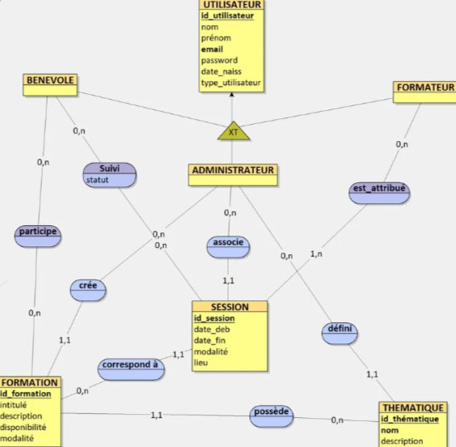

# Projet de développement mobile 

### Résumé : 
Développement d'une application sur la formation des citoyens sur différentes thématiques : tolérance, égalité, inclusion, citoyenneté...

### Stacks utilisées : 
- React Native
- Next.js
- Prisma

### MCD associé : 

### Lancement de l'application
- Dans un terminal se placer dans le dossier OpenMinds et faire :
> cd OpenMinds
> npx react-native start

- Dans un autre terminal se placer dans le dossier OpenMinds et faire :
> npx react-native run-android
 
- Dans un autre terminal se placer dans le dossier web et faire :
> cd web
> npx react-native start
